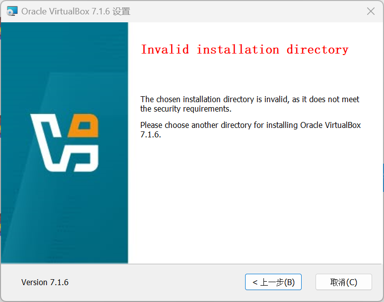
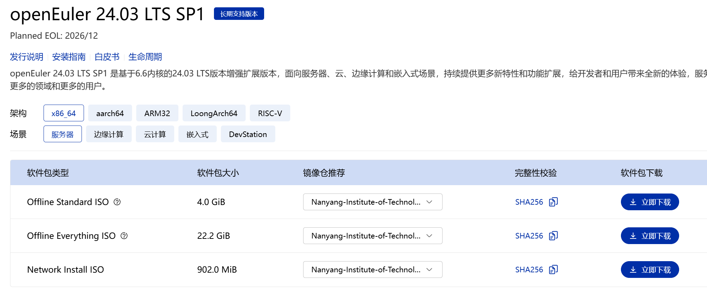
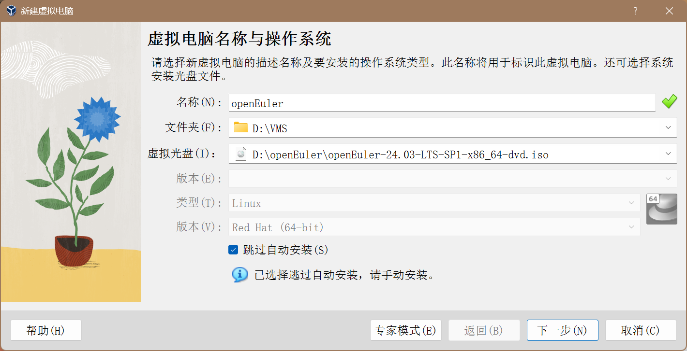
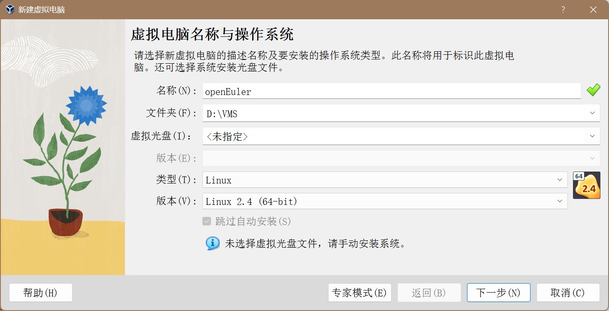
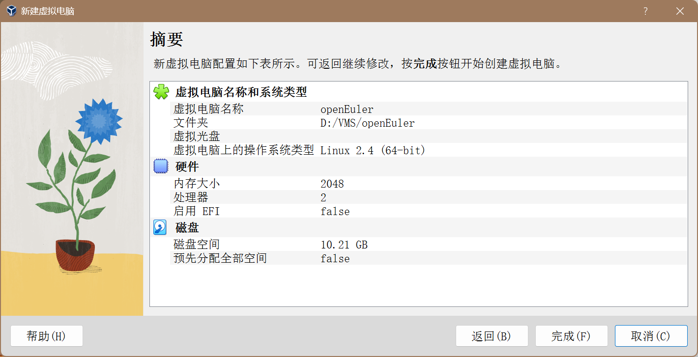
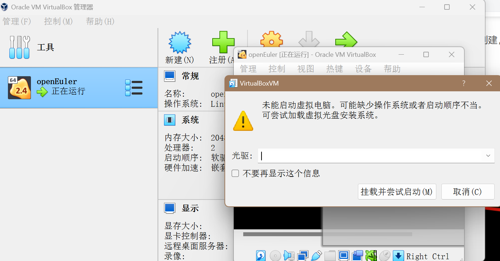
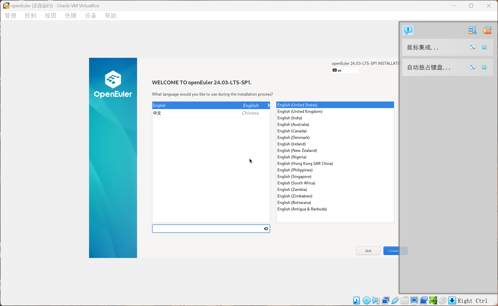
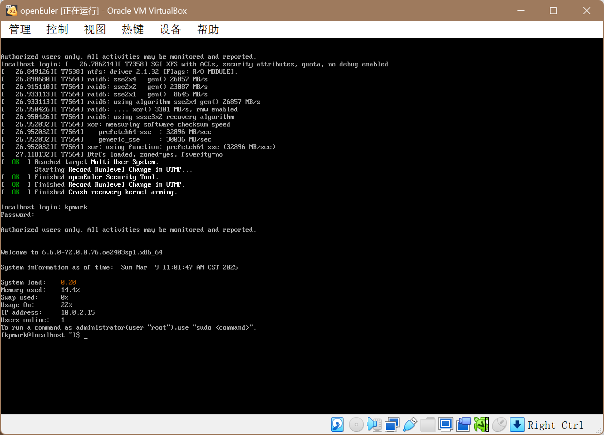
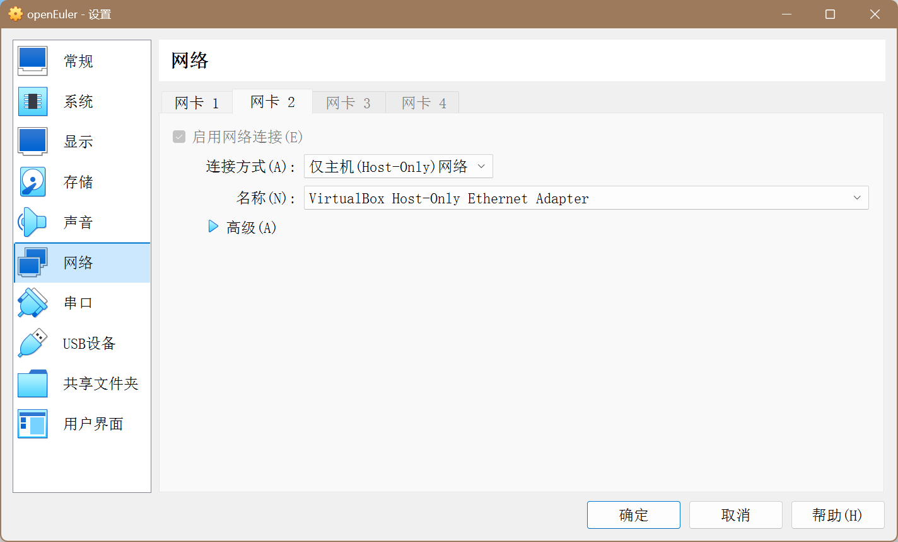
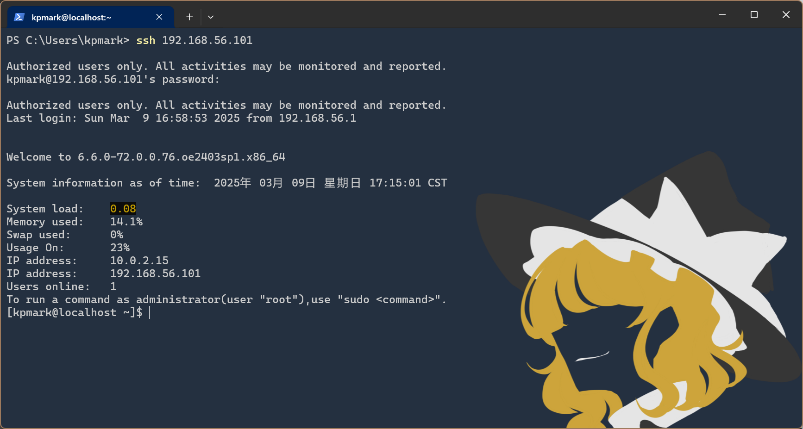

# 下载 VirtualBox

首先，从[官网](https://www.virtualbox.org/)下载 openEuler 安装程序


最新版本是 7.1.6，然而，在 7.0.14 到 7.0.16 的版本更新中，VirtualBox 将安装路径默认固定在了系统盘中，以防止用户重新写入或者重命名文件夹。但是我的 C 盘容量告急，所以这里选择查找历史版本 7.0.12 来进行安装



# 下载 openEuler 镜像

进入[openEuler 下载](https://www.openeuler.org/zh/download/)，选择合适的稳定版本

这里我暂时不在此环境中进行开发，所以选择进行最小安装



耐心等待下载即可

# 创建 openEuler 虚拟机

## 新建虚拟机

进入 VirtualBox，点击新建，开始创建虚拟机


为啥显示检测到了 Red Hat 呢，收集资料显示，openEuler 早期计数路线沿用了红帽系得 RPM 软件包管理系统和文件系统布局，和 CentOS 极为类似。这样，该系统能够兼容大量 CentOS/RHEL 开发的应用

不过我这里选择了跳过自动安装，这个自动检测类型应该不会有太大影响



分配 2GB 内存，给 2 个 CPU 核心，给 10GB 的虚拟硬盘



## 导入系统镜像

双击启动虚拟机，按照提示导入系统镜像



出现如下页面，启动成功



按照引导进行系统设置，预设好 root 账户和用户，就可以开始安装系统了，耐心等待即可

> 使用鼠标在虚拟机中进行操作时，虚拟机会自动捕获鼠标，使用右侧的 CTRL 键即可解放鼠标

安装好后，重启系统即可开始使用

> 注意，这里按照默认提示，仍然会进入虚拟盘的安装流程，这里应该先弹出安装系统使用的镜像，再重启系统



使用预设的用户名和密码登录，即可进入命令行界面

输入`pwd`查看当前路径


输入`ping www.bilibili.com`，显示如下响应


网络功能正常，此虚拟机运行成功

# 使用 SSH 连接虚拟机

在虚拟机的命令窗口中，鼠标会被捕获，没有语法高亮，且不能复制粘贴一些常用命令，所以我尝试在宿主机中使用 SSH 来连接本地的虚拟机

虚拟机默认的网络环境是 NAT 环境，即 VirtualBox 内置的 NAT 引擎充当虚拟路由器，分配一个私有 IP，将所有流量转发至主机的网络接口，进行地址转换后再访问外网

我们可以使用`ip addr`命令找到这个私有 IP：


但是，使用 NAT 模式是无法被宿主机访问的，所以我们尝试使用桥接模式

## 桥接

桥接，是通过将虚拟机直接连接到主机物理端口，把虚拟机当成局域网中的独立设备

通过手动取得宿主机静态 IP，我们可以通过给虚拟机的网卡分配同一网段下的 IP 地址，从而通过宿主机 SSH 访问

在网卡设置`/etc/sysconfig/network-scripts/ifcfg-enp0s3`中，我进行了如下修改

```ini
# ifcfg-enp0s3（静态IP）
BOOTPROTO=static
IPADDR=192.168.1.100
NETMASK=255.255.255.0
GATEWAY=192.168.1.1
```

然而，可能是我的无线网卡(AX 210)不支持桥接需要的混杂模式，或是我的配置过程出了问题，桥接之后，即使分配了 IP，虚拟机也一直无法连接外网

考虑使用 NAT + Host-Only 双网卡实现 SSH 连接

## NAT + Host-Only

仍保持默认的 NAT 网卡不变，我们在虚拟机设置中添加一块新的虚拟网卡



其中，这个 Host-Only 工具是在你下载 VirtualBox 的过程中自动下载的

然后，我们需要手动为自己的新网卡编写设置。首先使用`ip addr`找到新网卡的名称，我这里是`enp0s8`

然后，在`/etc/sysconfig/network-scripts/`目录下编写`ifcfg-enp0s8`文件，我的内容如下

```ini
DEVICE=enp0s8
NAME=enp0s8
TYPE=Ethernet
IPADDR=192.168.56.101
NETMASK=255.255.255.0
GATEWAY=192.168.56.1
DNS1=8.8.8.8
DNS2=8.8.4.4
ONBOOT=yes
```

这样，我就可以在宿主机的命令行中通过` ssh 192.168.56.101`连接至虚拟机了



# 疑问

我因为使用 Docker 的原因，开启了 WSL2 服务，电脑的 hyperV 应该是正常开启的。然而，在虚拟机安装过程中，并没有像其他人一样遇到启动报错的问题

VirtualBox 从 6.0 版本开始支持与 Hyper-V 共存，但是我并没有使用过这项配置

网络上关于这两个兼容性的文章都比较久远，可能是某次稳定版本更新之后默认开启的兼容设置吧

然后，为什么我的桥接设置始终失败，这很奇怪

考虑我的宿主机静态 IP 设置有误，或者真的是这块无线网卡不支持 VirtualBox 的混杂模式
