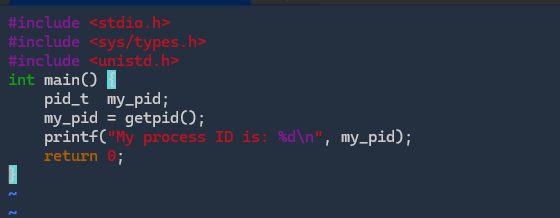
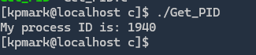
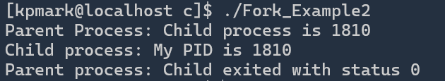
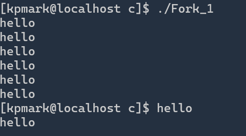
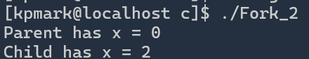

# 在 openEuler 中进行进程控制操作

## 安装开发环境

```she
# 安装 vim
sudo dnf install vim 
# 安装 gcc
sudo dnf install gcc
```

可以使用`vim -v`和`gcc -v`来验证安装是否成功

## 获取进程的 PID

使用以下命令新建 C 语言脚本

```shell
sudo touch Get_PID.c
```

编辑脚本

```shell
sudo vim Get_PID.c
```

在脚本中填写如下内容

```c
#include <stdio.h>
#include <sys/types.h>
#include <unistd.h>
int main() {
    pid_t  my_pid;
    my_pid = getpid();
    printf("My process ID is: %d\n", my_pid);
    return 0;
}
```

使用`:wq`命令保存并退出



然后，使用`sudo gcc -o Get_PID Get_PID.c`将 C 语言脚本编译为可执行文件

使用`./Get_PID`运行，出现如下响应



运行成功

## A simple fork() example

使用`sudo touch Fork_Example.c`创建代码文件，然后使用`sudo vim Fork_Example.c`向文件中写入如下代码

```c
#include <stdio.h>
#include <sys/types.h>
#include <unistd.h>
int main(){
    pid_t child_pid;
    child_pid = fork();
    if (child_pid < 0) {
        perror("Fork failed");
        return 1;
    } else if (child_pid == 0) {
        printf("Child process: My PID is %d/n", getpid());
    } else {
        printf("Parent process: My PID is %d/n", child_pid);
    }
    return 0;
}
```

使用`:wq`保存并退出后，使用`sudo gcc -o Fork_Example Fork_Example.c`命令进行编译

然后，使用`./Fork_Example`运行可执行文件，得到如下结果


运行成功

## Parent Process part with waitpid() call

将上述代码中的`else`逻辑改为以下内容

```c
#include <stdio.h>
#include <sys/types.h>
#include <unistd.h>
#include <sys/wait.h>
int main(){
    pid_t child_pid;
    child_pid = fork();
    if (child_pid < 0) {
        perror("Fork failed");
        return 1;
    } else if (child_pid == 0) {
        printf("Child process: My PID is %d/n", getpid());
    } else {
        printf("Parent Process: Child process is %d\n", child_pid);
        int status;
        waitpid(child_pid, &status, 0);
        if (WIFEXITED(status)) {
            printf("Parent process: Child exited with status %d\n", WEXITSTATUS(status));
        }
    }
    return 0;
}
```

输出结果如下



## Fork_1

按照如上方法，创建 Fork_1.c 文件，并向其中写上如下代码

```c
#include <stdio.h>
#include <sys/types.h>
#include <unistd.h>
int main() {
    fork();
    fork();
    fork();
    printf("hello\n");
    return 0;
}
```

编译并运行后，得到如下结果



共 8 此调用，为$2^3$，证明进程倍增的效果

## Fork_2

编写如下代码

```c
#include <stdio.h>
#include <stdlib.h>
#include <sys/types.h>
#include <unistd.h>

int main() {
    int x = 1;
    pid_t p = fork();
    if (p < 0) {
        perror("fork fail");
        exit(1);
    } else if (p == 0) {
        printf("Child has x = %d\n", ++x);
    } else {
        printf("Parent has x = %d\n", --x);
    }
    return 0;
}
```

编译运行后，有如下输出


